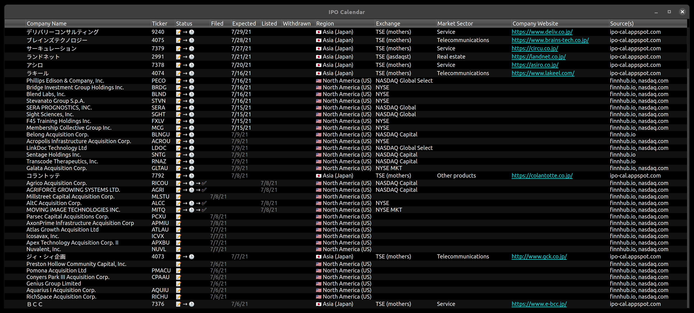

# IPO Stalker

Reminder system for upcoming IPOs.  Features automatic built-in scraping mechanism that aggregates data from multiple data sources.

## Data Sources

| Region              | Marketplace     | Name                               | Description                                |
|:--------------------|:----------------|:-----------------------------------|:-------------------------------------------|
| 🇺🇸 North America (US)  | NASDAQ NYSE | `nasdaq.com` `finnhub.io 🔑` | Recently listed and upcoming US IPOs       |
| 🇯🇵 East Asia (Japan)   | TSE             | `ipo-cal-appspot.com`            | Recently listed and upcoming Japanese IPOs |
| 🇮🇳 South Asia (India)  | BSE NSE     | `edelweiss.io`                   | Recently listed and upcoming Indian IPOs   |
| 🇺🇸 North America (US)  | OTC Markets     | `otcbb.swingtradebot.com`        | Recently listed OTC IPOs                   |
| 🇧🇪 Europe (Belgium) 🇫🇷 Europe (France) 🇮🇪 Europe (Ireland) 🇮🇹 Europe (Italy) 🇳🇱 Europe (Netherlands) 🇳🇴 Europe (Norway) 🇵🇹 Europe (Portugal) 🇵🇹 Europe (UK) | Euronext   | `euronext.com`                   | Upcoming European IPOs                     |

## Build

    qmake
    make -j

## Install

    sudo make install

## Uninstall

    sudo make uninstall

## Customize

Placing a file named `ipo-stalker.qss` into `~/.config/ipo-stalker/` will serve as custom stylesheet for the program.
You can use [ipo-stalker.qss](res/stylesheets/ipo-stalker.qss) for reference.
