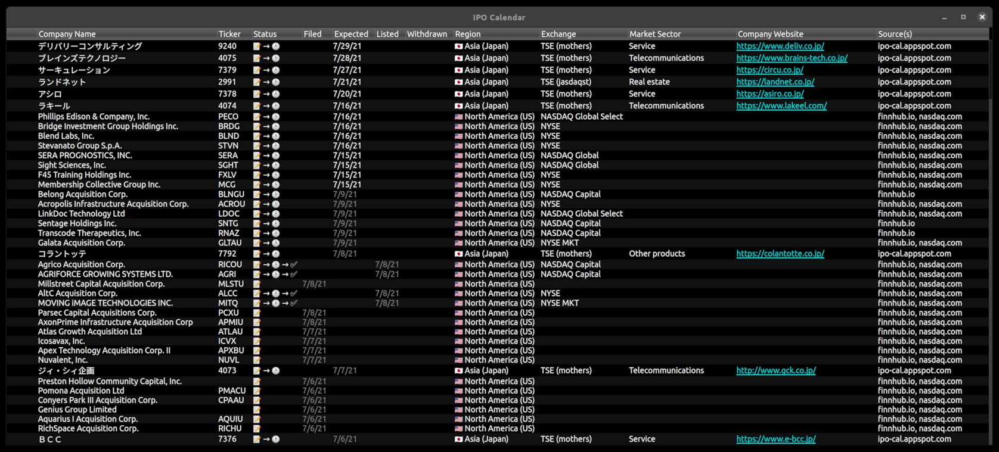

# IPO Calendar

Reminder system for upcoming IPOs.  Features automatic built-in scraping mechanism that aggregates data from multiple data sources.

## Build

    qmake
    make -j

## Install

    sudo make install

## Uninstall

    sudo make uninstall

## Customize

Placing a file named `ipo-calendar.qss` into `~/.config/ipo-calendar/` will serve as custom stylesheet for the program.
You can use [ipo-calendar.qss](res/stylesheets/ipo-calendar.qss) for reference.
